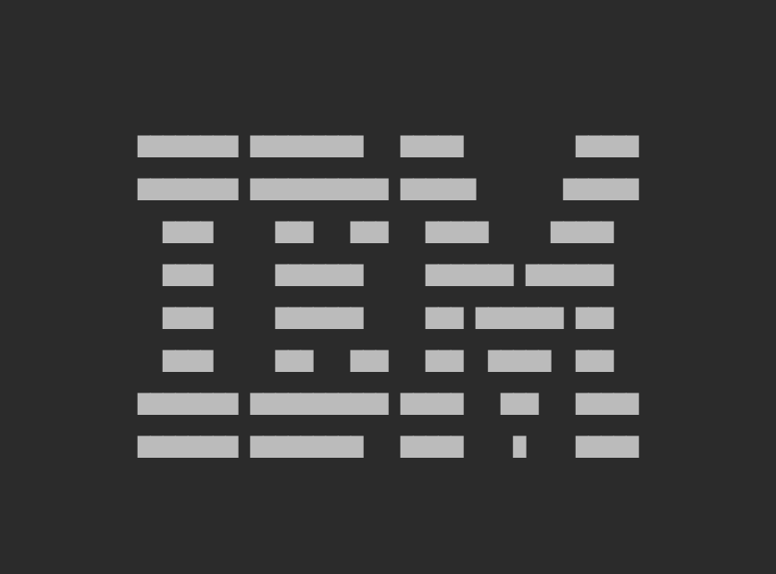
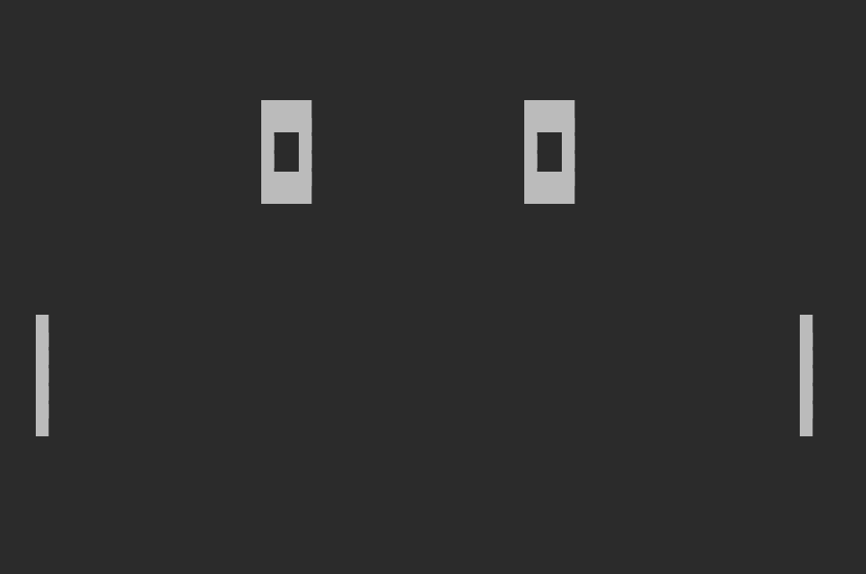

# Chip 8
A work-in-progress [Chip 8](https://en.wikipedia.org/wiki/CHIP-8) emulator written in Kotlin.

# Currently supported
* CPU opcode emulation
  * [Corax89](https://github.com/corax89/chip8-test-rom) test: **PASS**
  * [BonCoder (BC)](https://slack-files.com/T3CH37TNX-F3RF5KT43-0fb93dbd1f) test: **PASS**
* Timers emulation
* Fontset loading
* Rom loading into memory

# To be done
* Draw video buffer on a canvas
* Add input handling

# First Screenshots

# External references
* [Wikipedia page on Chip 8](https://en.wikipedia.org/wiki/CHIP-8)
* [Chip 8 - Technical reference](http://devernay.free.fr/hacks/chip8/C8TECH10.HTM)